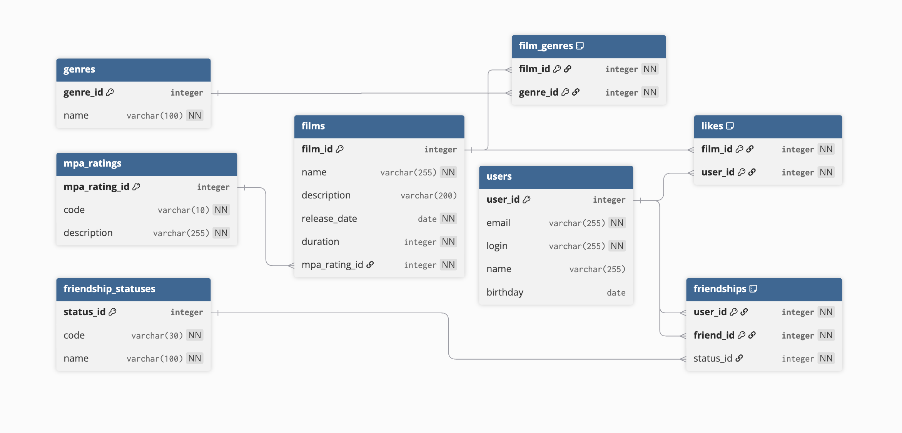

# Filmorate

Filmorate — приложение для работы с фильмами и пользователями.

Пользователи могут:

- создавать и обновлять профиль;
- добавлять других пользователей в друзья;
- получать список друзей;
- получать список общих друзей;
- добавлять лайки фильмам;
- удалять лайки;
- получать список популярных фильмов.

## Схема базы данных



## Описание схемы

База данных хранит информацию о пользователях, фильмах, жанрах, возрастных рейтингах MPA, лайках и дружбе между пользователями.

### Основные таблицы

#### `users`

Хранит пользователей приложения.

| Поле | Описание |
|---|---|
| `user_id` | Уникальный идентификатор пользователя |
| `email` | Электронная почта пользователя |
| `login` | Логин пользователя |
| `name` | Имя пользователя |
| `birthday` | Дата рождения пользователя |

#### `films`

Хранит фильмы.

| Поле | Описание |
|---|---|
| `film_id` | Уникальный идентификатор фильма |
| `name` | Название фильма |
| `description` | Описание фильма |
| `release_date` | Дата релиза |
| `duration` | Продолжительность фильма в минутах |
| `mpa_rating_id` | Идентификатор рейтинга MPA |

#### `mpa_ratings`

Справочник возрастных рейтингов MPA.

| Поле | Описание |
|---|---|
| `mpa_rating_id` | Уникальный идентификатор рейтинга |
| `code` | Код рейтинга: `G`, `PG`, `PG-13`, `R`, `NC-17` |
| `description` | Описание рейтинга |

Возможные значения:

| Код | Описание |
|---|---|
| `G` | У фильма нет возрастных ограничений |
| `PG` | Детям рекомендуется смотреть фильм с родителями |
| `PG-13` | Детям до 13 лет просмотр не желателен |
| `R` | Лицам до 17 лет просматривать фильм можно только в присутствии взрослого |
| `NC-17` | Лицам до 18 лет просмотр запрещён |

#### `genres`

Справочник жанров.

| Поле | Описание |
|---|---|
| `genre_id` | Уникальный идентификатор жанра |
| `name` | Название жанра |

Возможные значения:

| ID | Жанр |
|---|---|
| `1` | Комедия |
| `2` | Драма |
| `3` | Мультфильм |
| `4` | Триллер |
| `5` | Документальный |
| `6` | Боевик |

#### `film_genres`

Связующая таблица между фильмами и жанрами.

Один фильм может иметь несколько жанров.  
Один жанр может относиться к нескольким фильмам.

| Поле | Описание |
|---|---|
| `film_id` | Идентификатор фильма |
| `genre_id` | Идентификатор жанра |

Первичный ключ составной:

```sql
(film_id, genre_id)
```

Это не позволяет добавить один и тот же жанр одному фильму несколько раз.

#### `likes`

Связующая таблица между пользователями и фильмами.

Один пользователь может поставить лайк нескольким фильмам.  
Один фильм может получить лайки от многих пользователей.

| Поле | Описание |
|---|---|
| `film_id` | Идентификатор фильма |
| `user_id` | Идентификатор пользователя |

Первичный ключ составной:

```sql
(film_id, user_id)
```

Это не позволяет одному пользователю поставить одному фильму несколько лайков.

#### `friendship_statuses`

Справочник статусов дружбы.

| Поле | Описание |
|---|---|
| `status_id` | Уникальный идентификатор статуса |
| `code` | Код статуса |
| `name` | Название статуса |

Возможные значения:

| Код | Описание |
|---|---|
| `UNCONFIRMED` | Неподтверждённая дружба |
| `CONFIRMED` | Подтверждённая дружба |

#### `friendships`

Хранит связи дружбы между пользователями.

| Поле | Описание |
|---|---|
| `user_id` | Пользователь, который отправил заявку в друзья |
| `friend_id` | Пользователь, которому отправили заявку |
| `status_id` | Статус дружбы |

Первичный ключ составной:

```sql
(user_id, friend_id)
```

Это не позволяет создать две одинаковые заявки между одними и теми же пользователями в одном направлении.

## Почему схема устроена так

### Жанры вынесены в отдельную таблицу

У фильма может быть несколько жанров. Например, фильм может быть одновременно комедией и драмой.

Плохой вариант:

```text
films.genres = "Комедия, Драма"
```

Такой подход нарушает первую нормальную форму, потому что в одной ячейке хранится несколько значений.

Хороший вариант:

```text
films
genres
film_genres
```

Таблица `film_genres` хранит связь между фильмами и жанрами.

### Лайки вынесены в отдельную таблицу

В Java-коде лайки можно хранить как `Set<Integer>`, но в реляционной базе данных список лайков не должен храниться в одной колонке.

Плохой вариант:

```text
films.likes = [1, 2, 3]
```

Хороший вариант:

```text
likes(film_id, user_id)
```

Каждая строка таблицы `likes` означает один факт:

```text
пользователь поставил лайк фильму
```

### Дружба вынесена в отдельную таблицу

Дружба — это связь между двумя пользователями. У этой связи есть дополнительное свойство — статус.

Поэтому дружбу лучше хранить не в таблице `users`, а в отдельной таблице `friendships`.

Каждая строка таблицы `friendships` означает один факт:

```text
один пользователь отправил заявку другому пользователю
```

Статус заявки хранится через `status_id`.

### MPA-рейтинг вынесен в справочник

MPA-рейтинг является справочным значением. Один и тот же рейтинг может быть у большого количества фильмов.

Поэтому вместо хранения строки `PG-13` или `R` прямо в таблице `films`, используется ссылка на таблицу `mpa_ratings`.

## Примеры SQL-запросов

### Получение всех пользователей

```sql
SELECT *
FROM users;
```

### Получение пользователя по идентификатору

```sql
SELECT *
FROM users
WHERE user_id = ?;
```

### Создание пользователя

```sql
INSERT INTO users (email, login, name, birthday)
VALUES (?, ?, ?, ?);
```

### Обновление пользователя

```sql
UPDATE users
SET email = ?,
    login = ?,
    name = ?,
    birthday = ?
WHERE user_id = ?;
```

### Получение всех фильмов с рейтингом MPA

```sql
SELECT 
    f.film_id,
    f.name,
    f.description,
    f.release_date,
    f.duration,
    m.mpa_rating_id,
    m.code AS mpa_code,
    m.description AS mpa_description
FROM films AS f
JOIN mpa_ratings AS m ON f.mpa_rating_id = m.mpa_rating_id;
```

### Получение фильма по идентификатору

```sql
SELECT 
    f.film_id,
    f.name,
    f.description,
    f.release_date,
    f.duration,
    m.mpa_rating_id,
    m.code AS mpa_code,
    m.description AS mpa_description
FROM films AS f
JOIN mpa_ratings AS m ON f.mpa_rating_id = m.mpa_rating_id
WHERE f.film_id = ?;
```

### Создание фильма

```sql
INSERT INTO films (name, description, release_date, duration, mpa_rating_id)
VALUES (?, ?, ?, ?, ?);
```

### Обновление фильма

```sql
UPDATE films
SET name = ?,
    description = ?,
    release_date = ?,
    duration = ?,
    mpa_rating_id = ?
WHERE film_id = ?;
```

### Получение жанров фильма

```sql
SELECT 
    g.genre_id,
    g.name
FROM genres AS g
JOIN film_genres AS fg ON g.genre_id = fg.genre_id
WHERE fg.film_id = ?;
```

### Добавление жанра фильму

```sql
INSERT INTO film_genres (film_id, genre_id)
VALUES (?, ?);
```

### Удаление всех жанров фильма

```sql
DELETE FROM film_genres
WHERE film_id = ?;
```

Такой запрос может использоваться перед обновлением списка жанров фильма.

### Получение фильма вместе с жанрами

```sql
SELECT 
    f.film_id,
    f.name,
    f.description,
    f.release_date,
    f.duration,
    m.code AS mpa_code,
    g.genre_id,
    g.name AS genre_name
FROM films AS f
JOIN mpa_ratings AS m ON f.mpa_rating_id = m.mpa_rating_id
LEFT JOIN film_genres AS fg ON f.film_id = fg.film_id
LEFT JOIN genres AS g ON fg.genre_id = g.genre_id
WHERE f.film_id = ?;
```

`LEFT JOIN` используется для жанров, чтобы фильм попал в результат даже в том случае, если у него пока нет жанров.

### Добавление лайка фильму

```sql
INSERT INTO likes (film_id, user_id)
VALUES (?, ?);
```

Здесь:

- `film_id` — фильм, которому ставят лайк;
- `user_id` — пользователь, который ставит лайк.

### Удаление лайка

```sql
DELETE FROM likes
WHERE film_id = ?
  AND user_id = ?;
```

### Получение количества лайков фильма

```sql
SELECT 
    f.film_id,
    f.name,
    COUNT(l.user_id) AS likes_count
FROM films AS f
LEFT JOIN likes AS l ON f.film_id = l.film_id
WHERE f.film_id = ?
GROUP BY f.film_id, f.name;
```

### Получение популярных фильмов

```sql
SELECT 
    f.film_id,
    f.name,
    f.description,
    f.release_date,
    f.duration,
    f.mpa_rating_id,
    COUNT(l.user_id) AS likes_count
FROM films AS f
LEFT JOIN likes AS l ON f.film_id = l.film_id
GROUP BY 
    f.film_id,
    f.name,
    f.description,
    f.release_date,
    f.duration,
    f.mpa_rating_id
ORDER BY likes_count DESC
LIMIT ?;
```

`LEFT JOIN` используется, чтобы в результат попадали даже фильмы без лайков.

### Отправка заявки в друзья

```sql
INSERT INTO friendships (user_id, friend_id, status_id)
VALUES (
    ?,
    ?,
    (
        SELECT status_id
        FROM friendship_statuses
        WHERE code = 'UNCONFIRMED'
    )
);
```

Здесь:

- `user_id` — пользователь, который отправил заявку;
- `friend_id` — пользователь, которому отправили заявку.

### Подтверждение дружбы

```sql
UPDATE friendships
SET status_id = (
    SELECT status_id
    FROM friendship_statuses
    WHERE code = 'CONFIRMED'
)
WHERE user_id = ?
  AND friend_id = ?;
```

### Удаление пользователя из друзей

```sql
DELETE FROM friendships
WHERE (user_id = ? AND friend_id = ?)
   OR (user_id = ? AND friend_id = ?);
```

Такой вариант удаляет связь независимо от того, в каком направлении она была создана.

### Получение подтверждённых друзей пользователя

```sql
SELECT u.*
FROM users AS u
JOIN friendships AS f
    ON u.user_id = CASE
        WHEN f.user_id = ? THEN f.friend_id
        ELSE f.user_id
    END
JOIN friendship_statuses AS fs ON f.status_id = fs.status_id
WHERE fs.code = 'CONFIRMED'
  AND (f.user_id = ? OR f.friend_id = ?);
```

В этом запросе учитывается, что пользователь может находиться как в поле `user_id`, так и в поле `friend_id`.

### Получение общих друзей двух пользователей

```sql
WITH first_user_friends AS (
    SELECT 
        CASE
            WHEN f.user_id = ? THEN f.friend_id
            ELSE f.user_id
        END AS friend_id
    FROM friendships AS f
    JOIN friendship_statuses AS fs ON f.status_id = fs.status_id
    WHERE fs.code = 'CONFIRMED'
      AND (f.user_id = ? OR f.friend_id = ?)
),
second_user_friends AS (
    SELECT 
        CASE
            WHEN f.user_id = ? THEN f.friend_id
            ELSE f.user_id
        END AS friend_id
    FROM friendships AS f
    JOIN friendship_statuses AS fs ON f.status_id = fs.status_id
    WHERE fs.code = 'CONFIRMED'
      AND (f.user_id = ? OR f.friend_id = ?)
)
SELECT u.*
FROM users AS u
JOIN first_user_friends AS fuf ON u.user_id = fuf.friend_id
JOIN second_user_friends AS suf ON u.user_id = suf.friend_id;
```

Этот запрос:

1. получает друзей первого пользователя;
2. получает друзей второго пользователя;
3. находит пользователей, которые есть в обоих списках.

## Пример наполнения справочников

### Рейтинги MPA

```sql
INSERT INTO mpa_ratings (mpa_rating_id, code, description)
VALUES
    (1, 'G', 'У фильма нет возрастных ограничений'),
    (2, 'PG', 'Детям рекомендуется смотреть фильм с родителями'),
    (3, 'PG-13', 'Детям до 13 лет просмотр не желателен'),
    (4, 'R', 'Лицам до 17 лет просматривать фильм можно только в присутствии взрослого'),
    (5, 'NC-17', 'Лицам до 18 лет просмотр запрещён');
```

### Жанры

```sql
INSERT INTO genres (genre_id, name)
VALUES
    (1, 'Комедия'),
    (2, 'Драма'),
    (3, 'Мультфильм'),
    (4, 'Триллер'),
    (5, 'Документальный'),
    (6, 'Боевик');
```

### Статусы дружбы

```sql
INSERT INTO friendship_statuses (status_id, code, name)
VALUES
    (1, 'UNCONFIRMED', 'Неподтверждённая'),
    (2, 'CONFIRMED', 'Подтверждённая');
```

## Нормализация

Схема соответствует основным требованиям нормализации:

- в одной ячейке хранится только одно значение;
- списки жанров, лайков и друзей вынесены в отдельные таблицы;
- неключевые поля зависят от первичного ключа;
- справочные значения вынесены в отдельные таблицы;
- связи многие-ко-многим реализованы через промежуточные таблицы.

## Файлы проекта, связанные со схемой

```text
docs/filmorate-er-diagram.png
README.md
```